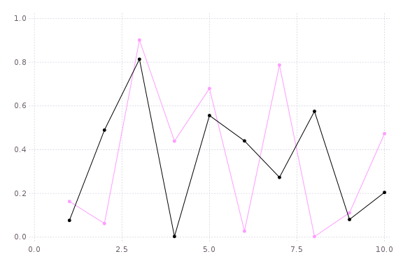

# Plots

[](https://travis-ci.org/tbreloff/Plots.jl)

#### Author: Thomas Breloff (@tbreloff)

Plots is a plotting interface and wrapper for several plotting packages.  My goals with the package are:

- Simple.  The interface should be intuitive enough that someone coming from Matlab, Python, etc can immediately start generating complex plots without reading volumes of documentation.
- Automatic (if you want).  There should be smart defaults for the most common functionality, and simple, high-level ways to override complex functionality.
- Flexible.  You should be able to produce your favorite plot in your favorite package, but quicker and simpler.
- Consistent.  Don't commit to one graphics package.  One command will switch your backend, and the exact same plotting commands will work with a very different underlying backend.

Please add wishlist items, bugs, or any other comments/questions to the issues list.

## Examples for each implemented backend:

- [Qwt.jl](docs/qwt_examples.md)
- [Gadfly.jl](docs/gadfly_examples.md)
- [UnicodePlots.jl](docs/unicodeplots_examples.md)
- [PyPlot.jl](docs/pyplot_examples.md)
- [Immerse.jl](docs/immerse_examples.md)
- [Winston.jl](docs/winston_examples.md)

## Installation

First, add the package

```julia
Pkg.add("Plots")
```

then get any plotting packages you need (obviously, you should get at least one backend):

```julia
Pkg.add("Gadfly")
Pkg.add("Immerse")
Pkg.add("UnicodePlots")
Pkg.add("PyPlot")                                    # requires python and matplotlib
Pkg.clone("https://github.com/tbreloff/Qwt.jl.git")  # requires pyqt and pyqwt
Pkg.add("Winston")
```

## Use

Load it in.  The underlying plotting backends are not imported until `plotter()` is called (which happens
on your first call to `plot` or `subplot`).  This means that you don't need any backends to be installed when you call `using Plots`.
Plots will try to figure out a good default backend for you automatically based on what backends are installed.

```julia
using Plots
```

Do a plot in Gadfly, then save a png:

```julia
# switch to Gadfly as a backend
gadfly!()

# This will bring up a browser window with the plot. Add a semicolon at the end to skip display. 
plot(rand(10,2); marker = :rect, markersize = [10,30], style = :auto)

# save it as a PNG
savepng(Plots.IMG_DIR * "gadfly1.png")
```

which saves:



See the examples pages for lots of examples of plots, and what those commands produce for each supported backend.

## API

Call `plotter!(backend::Symbol)` or the shorthands (`gadfly!()`, `qwt!()`, `unicodeplots!()`, etc) to set the current plotting backend.
Subsequent commands are converted into the relevant plotting commands for that package:

```julia
gadfly!()
plot(1:10)    # this effectively calls `y = 1:10; Gadfly.plot(x=1:length(y), y=y)`
qwt!()
plot(1:10)    # this effectively calls `Qwt.plot(1:10)`
```

Use `plot` to create a new plot object, and `plot!` to add to an existing one:

```julia
plot(args...; kw...)                  # creates a new plot window, and sets it to be the `currentPlot`
plot!(args...; kw...)                 # adds to the `currentPlot`
plot!(plotobj, args...; kw...)        # adds to the plot `plotobj`
```

Now that you know which plot object you're updating (new, current, or other), I'll leave it off for simplicity.
There are many ways to pass in data to the plot functions... some examples:

- Vector-like (subtypes of AbstractArray{T,1})
- Matrix-like (subtypes of AbstractArray{T,2})
- Vectors of Vectors
- Functions
- Vectors of Functions
- DataFrames with column symbols (initialize with `dataframes!()`)

In general, you can pass in a `y` only, or an `x` and `y`, both of whatever type(s) you want, and Plots will slice up the data as needed.
For matrices, data is split by columns.  For functions, data is mapped.  For DataFrames (TODO), a Symbol/Symbols in place of x/y will map to
the relevant column(s) and also automatically set the associated legend label.

Here are some example usages... remember you can always use `plot!` to update an existing plot, and that, unless specified, you will update the `currentPlot()`.

```julia
plot()                          # empty plot object
plot(4)                         # initialize with 4 empty series
plot(rand(10))                  # plot 1 series... x = 1:10
plot(rand(10,5))                # plot 5 series... x = 1:10
plot(rand(10), rand(10))        # plot 1 series
plot(rand(10,5), rand(10))      # plot 5 series... y is the same for all
plot(sin, rand(10))             # y = sin(x)
plot(rand(10), sin)             # same... y = sin(x)
plot([sin,cos], 0:0.1:π)        # plot 2 series, sin(x) and cos(x)
plot([sin,cos], 0, π)           # plot sin and cos on the range [0, π]
plot(1:10, Any[rand(10), sin])  # plot 2 series, y = rand(10) for the first, y = sin(x) for the second... x = 1:10 for both
plot(dataset("Ecdat", "Airline"), :Cost)  # plot from a DataFrame
```

With `subplot`, create multiple plots at once, with flexible layout options:

```julia
y = rand(100,3)
subplot(y; n = 3)             # create an automatic grid, and let it figure out the shape
subplot(y; n = 3, nr = 1)     # create an automatic grid, but fix the number of rows
subplot(y; n = 3, nc = 1)     # create an automatic grid, but fix the number of columns
subplot(y; layout = [1, 2])   # explicit layout.  Lists the number of plots in each row
```

__Tip__: You can call `subplot!(args...; kw...)` to add to an existing subplot.

__Tip__: Calling `subplot!` on a `Plot` object, or `plot!` on a `Subplot` object will throw an error.

Shorthands:

```julia
scatter(args...; kw...)    = plot(args...; kw...,  linetype = :scatter)
scatter!(args...; kw...)   = plot!(args...; kw..., linetype = :scatter)
bar(args...; kw...)        = plot(args...; kw...,  linetype = :bar)
bar!(args...; kw...)       = plot!(args...; kw..., linetype = :bar)
histogram(args...; kw...)  = plot(args...; kw...,  linetype = :hist)
histogram!(args...; kw...) = plot!(args...; kw..., linetype = :hist)
heatmap(args...; kw...)    = plot(args...; kw...,  linetype = :heatmap)
heatmap!(args...; kw...)   = plot!(args...; kw..., linetype = :heatmap)
sticks(args...; kw...)     = plot(args...; kw...,  linetype = :sticks, marker = :ellipse)
sticks!(args...; kw...)    = plot!(args...; kw..., linetype = :sticks, marker = :ellipse)
hline(args...; kw...)      = plot(args...; kw...,  linetype = :hline)
hline!(args...; kw...)     = plot!(args...; kw..., linetype = :hline)
vline(args...; kw...)      = plot(args...; kw...,  linetype = :vline)
vline!(args...; kw...)     = plot!(args...; kw..., linetype = :vline)
ohlc(args...; kw...)       = plot(args...; kw...,  linetype = :ohlc)
ohlc!(args...; kw...)      = plot!(args...; kw..., linetype = :ohlc)
```

Some keyword arguments you can set:

Keyword | Default | Type | Aliases 
---- | ---- | ---- | ----
`:args` | `Any[]` | Series | `:argss`  
`:axis` | `left` | Series | `:axiss`  
`:color` | `auto` | Series | `:c`, `:colors`  
`:fillto` | `nothing` | Series | `:area`, `:fill`, `:filltos`  
`:group` | `nothing` | Series | `:g`, `:groups`  
`:heatmap_c` | `(0.15,0.5)` | Series | `:heatmap_cs`  
`:kwargs` | `Any[]` | Series | `:kwargss`  
`:label` | `AUTO` | Series | `:lab`, `:labels`  
`:linestyle` | `solid` | Series | `:linestyles`, `:ls`, `:s`, `:style`  
`:linetype` | `path` | Series | `:linetypes`, `:lt`, `:t`, `:type`  
`:marker` | `none` | Series | `:m`, `:markers`  
`:markercolor` | `match` | Series | `:markercolors`, `:mc`, `:mcolor`  
`:markersize` | `6` | Series | `:markersizes`, `:ms`, `:msize`  
`:nbins` | `100` | Series | `:nb`, `:nbin`, `:nbinss`  
`:reg` | `false` | Series | `:regs`  
`:ribbon` | `nothing` | Series | `:r`, `:ribbons`  
`:width` | `1` | Series | `:linewidth`, `:w`, `:widths`  
`:background_color` | `RGB{U8}(1.0,1.0,1.0)` | Plot | `:background`, `:bg`, `:bg_color`, `:bgcolor`  
`:foreground_color` | `auto` | Plot | `:fg`, `:fg_color`, `:fgcolor`, `:foreground`  
`:legend` | `true` | Plot | `:leg`  
`:show` | `false` | Plot | `:display`  
`:size` | `(800,600)` | Plot | `:windowsize`, `:wsize`  
`:title` | `` | Plot |   
`:windowtitle` | `Plots.jl` | Plot | `:wtitle`  
`:xlabel` | `` | Plot | `:xlab`  
`:xticks` | `true` | Plot |   
`:ylabel` | `` | Plot | `:ylab`  
`:yrightlabel` | `` | Plot | `:y2lab`, `:y2label`, `:ylab2`, `:ylabel2`, `:ylabelright`, `:ylabr`, `:yrlab`  
`:yticks` | `true` | Plot |   


Plot types:

Type | Desc | Aliases
---- | ---- | ----
`:none` | No line | `:n`, `:no`  
`:line` | Lines with sorted x-axis | `:l`  
`:path` | Lines | `:p`  
`:steppre` | Step plot (vertical then horizontal) | `:stepinv`, `:stepinverted`  
`:steppost` | Step plot (horizontal then vertical) | `:stair`, `:stairs`, `:step`  
`:sticks` | Vertical lines | `:stem`  
`:scatter` | Points, no lines | `:dots`  
`:heatmap` | Colored regions by density |   
`:hexbin` | Similar to heatmap |   
`:hist` | Histogram (doesn't use x) | `:histogram`  
`:bar` | Bar plot (centered on x values) |   
`:hline` | Horizontal line (doesn't use x) |   
`:vline` | Vertical line (doesn't use x) |   
`:ohlc` | Open/High/Low/Close chart (expects y is vector of 4-tuples) |   


Line styles:

Type | Aliases
---- | ----
`:auto` | `:a`  
`:solid` | `:s`  
`:dash` | `:d`  
`:dot` |   
`:dashdot` | `:dd`  
`:dashdotdot` | `:ddd`  


Markers:

Type | Aliases
---- | ----
`:none` | `:n`, `:no`  
`:auto` | `:a`  
`:ellipse` | `:c`, `:circle`  
`:rect` | `:r`, `:sq`, `:square`  
`:diamond` | `:d`  
`:utriangle` | `:^`, `:uptri`, `:uptriangle`, `:ut`, `:utri`  
`:dtriangle` | `:V`, `:downtri`, `:downtriangle`, `:dt`, `:dtri`, `:v`  
`:cross` | `:+`, `:plus`  
`:xcross` | `:X`, `:x`  
`:star1` | `:s`, `:star`  
`:star2` | `:s2`  
`:hexagon` | `:h`, `:hex`  
`:octagon` | `:o`, `:oct`  


__Tip__: You can see the default value for a given argument with `plotDefault(arg::Symbol)`, and set the default value with `plotDefault!(arg::Symbol, value)`

__Tip__: When plotting multiple lines, you can set all series to use the same value, or pass in an array to cycle through values.  Example:

```julia
plot(rand(100,4); color = [:red, RGB(0,0,1)],    # lines 1 and 3 are red, lines 2 and 4 are blue
                  axis = :auto,                  # lines 1 and 3 are on the left axis, lines 2 and 4 are on the right
                  width = 5)                     # all lines have a width of 5
```

__Tip__: Not all features are supported for each backend, but you can see what's supported by calling the functions: `supportedAxes()`, `supportedTypes()`, `supportedStyles()`, `supportedMarkers()`, `subplotSupported()`

__Tip__: Call `gui()` to display the plot in a window.  Interactivity depends on backend.  Showing at the REPL implicitly calls this.

## TODO features:

- [x] Plot vectors/matrices/functions
- [ ] Plot DataFrames
- [ ] Scales
- [ ] Categorical Inputs (strings, etc... for hist, bar? or can split one series into multiple?)
- [ ] Custom markers
- [ ] Special plots (boxplot, ohlc?)
- [x] Subplots
- [x] Histograms
- [ ] 3D plotting
- [ ] Scenes/Drawing
- [ ] Graphs
- [ ] Interactivity (GUIs)

## TODO backends:

- [x] Gadfly.jl
- [x] Immerse.jl
- [x] PyPlot.jl
- [x] UnicodePlots.jl
- [x] Qwt.jl
- [x] Winston.jl
- [ ] GLPlot.jl
- [ ] Bokeh.jl
- [ ] Vega.jl
- [ ] Gaston.jl
- [ ] Plotly.jl
- [ ] GoogleCharts.jl
- [ ] PLplot.jl
- [ ] TextPlots.jl
- [ ] ASCIIPlots.jl
- [ ] Sparklines.jl
- [ ] Hinton.jl
- [ ] ImageTerm.jl
- [ ] GraphViz.jl
- [ ] TikzGraphs.jl
- [ ] GraphLayout.jl

## More information on backends (both supported and unsupported)

See the wiki at: https://github.com/JuliaPlot/juliaplot_docs/wiki


