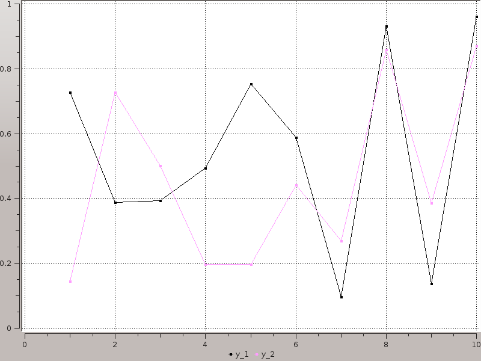

# Plots

[](https://travis-ci.org/tbreloff/Plots.jl)

#### Author: Thomas Breloff (@tbreloff)

Plotting interface and wrapper for several plotting packages.

Please add wishlist items, bugs, or any other comments/questions to the issues list.

## Examples for each implemented backend:

- [Qwt.jl](docs/qwt_examples.md)
- [Gadfly.jl](docs/gadfly_examples.md)
- [UnicodePlots.jl](docs/unicodeplots_examples.md)

## Installation

First, clone the package, and get any plotting packages you need (obviously, you should get at least one backend):

```julia
Pkg.clone("https://github.com/tbreloff/Plots.jl.git")
Pkg.add("Gadfly")                                     # [optional]
Pkg.clone("https://github.com/tbreloff/Qwt.jl.git")   # [optional] requires pyqt and pyqwt
Pkg.add("UnicodePlots")                               # [optional]
```

## Use

Load it in.  The underlying plotting backends are not imported until `plotter()` is called (which happens
on your first call to `plot`).  This means that you don't need any backends to be installed when you call `using Plots`.
For now, the default backend is Gadfly.

```julia
using Plots
```

Do a plot in Gadfly, then save a png:

```julia
plot(rand(10,2); marker = :rect)   # this will bring up a browser window with the plot, set show=false if you don't want that
savepng(Plots.IMG_DIR * "gadfly1.png")
```

which saves:


Do a plot in Qwt, then save a png:

```julia
qwt!()  # switches the backend to Qwt... equivalent to `plotter!(:qwt)`
plot(rand(10,2); marker = :rect)   # pops up an interactive window with the plot... set show=false to keep it hidden
savepng(Plots.IMG_DIR * "qwt1.png")
```

which saves:



See the examples pages for much more in every supported backend.

## plot and plotter! interface (WIP)

The main plot command.  Call `plotter!(:module)` or `module!()` (i.e. `qwt!()`, `unicodeplots!()`, etc) to set the current plotting backend.
Commands are converted into the relevant plotting commands for that package:

```julia
  gadfly!()    # equivalent to `plotter!(:gadfly)`
  plot(1:10)    # this effectively calls `y = 1:10; Gadfly.plot(x=1:length(y), y=y)`
  qwt!()
  plot(1:10)    # this effectively calls `Qwt.plot(1:10)`
```

Use `plot` to create a new plot object, and `plot!` to add to an existing one:

```julia
  plot(args...; kw...)                  # creates a new plot window, and sets it to be the `currentPlot`
  plot!(args...; kw...)                 # adds to the `currentPlot`
  plot!(plotobj, args...; kw...)        # adds to the plot `plotobj`
```

Now that you know which plot object you're updating (new, current, or other), I'll leave it off for simplicity.
Here are some various args to supply, and the implicit mapping (AVec == AbstractVector and AMat == AbstractMatrix):

```julia
  plot(y::AVec; kw...)                       # one line... x = 1:length(y)
  plot(x::AVec, y::AVec; kw...)              # one line (will assert length(x) == length(y))
  plot(y::AMat; kw...)                       # multiple lines (one per column of x), all sharing x = 1:size(y,1)
  plot(x::AVec, y::AMat; kw...)              # multiple lines (one per column of x), all sharing x (will assert length(x) == size(y,1))
  plot(x::AMat, y::AMat; kw...)              # multiple lines (one per column of x/y... will assert size(x) == size(y))
  plot(f::Function, xmin::Real, xmax::Real; kw...)        # one line, map function for range [xmin,xmax]
  plot(f::AVec{Function}, xmin::Real, xmax::Real; kw...)  # multiple lines, map functions for range [xmin,xmax]
  plot(fx::Function, fy::Function, umin::Real, umax::Real; kw...)  # parametric plot... x = fx(u), y = fy(u)
  plot(x::AVec, f::Function; kw...)          # one line, y = f(x)... can swap x and f
  plot(x::AMat, f::Function; kw...)          # multiple lines, yᵢⱼ = f(xᵢⱼ)... can swap f and x
  plot(x::AVec, fs::AVec{Function}; kw...)   # multiple lines, yᵢⱼ = fⱼ(xᵢ)
  plot(y::AVec{AVec}; kw...)                 # multiple lines, each with x = 1:length(y[i])
  plot(x::AVec, y::AVec{AVec}; kw...)        # multiple lines, will assert length(x) == length(y[i])
  plot(x::AVec{AVec}, y::AVec{AVec}; kw...)  # multiple lines, will assert length(x[i]) == length(y[i])
  plot(n::Integer; kw...)                    # n lines, all empty (for updating plots)

  # TODO: how do we handle NA values in dataframes?
  plot(df::DataFrame; kw...)                 # one line per DataFrame column, labels == names(df)
  plot(df::DataFrame, columns; kw...)        # one line per column, but on a subset of column names
```

[TODO] You can swap out `plot` for `subplot`.  Each line will go into a separate plot.  Use the layout keyword:

```julia
  y = rand(100,3)
  subplot(y; n = 3)             # create an automatic grid, and let it figure out the nr/nc... will put plots 1 and 2 on the first row, and plot 3 by itself on the 2nd row
  subplot(y; n = 3, nr = 1)     # create an automatic grid, but fix the number of rows to 1 (so there are n columns)
  subplot(y; n = 3, nc = 1)     # create an automatic grid, but fix the number of columns to 1 (so there are n rows)
  subplot(y; layout = [1, 2])   # explicit layout by row... plot #1 goes by itself in the first row, plots 2 and 3 split the 2nd row (note the n kw is unnecessary)
```

Shorthands:

```julia
  scatter(args...; kw...)    = plot(args...; kw...,  linetype = :none, marker = :hexagon)
  scatter!(args...; kw...)   = plot!(args...; kw..., linetype = :none, marker = :hexagon)
  bar(args...; kw...)        = plot(args...; kw...,  linetype = :bar)
  bar!(args...; kw...)       = plot!(args...; kw..., linetype = :bar)
  histogram(args...; kw...)  = plot(args...; kw...,  linetype = :hist)
  histogram!(args...; kw...) = plot!(args...; kw..., linetype = :hist)
  heatmap(args...; kw...)    = plot(args...; kw...,  linetype = :heatmap)
  heatmap!(args...; kw...)   = plot!(args...; kw..., linetype = :heatmap)
```

Some keyword arguments you can set:

```
  axis            # :left or :right
  color           # can be a string ("red") or a symbol (:red) or a ColorsTypes.jl Colorant (RGB(1,0,0)) or :auto (which lets the package pick)
  label           # string or symbol, applies to that line, may go in a legend
  width           # width of a line
  linetype        # :line, :step, :stepinverted, :sticks, :dots, :none, :heatmap, :hexbin, :hist, :bar
  linestyle       # :solid, :dash, :dot, :dashdot, :dashdotdot
  marker          # :none, :ellipse, :rect, :diamond, :utriangle, :dtriangle, :cross, :xcross, :star1, :star2, :hexagon
  markercolor     # same choices as `color`, or :match will set the color to be the same as `color`
  markersize      # size of the marker
  nbins           # number of bins for heatmap/hexbin and histograms
  heatmap_c       # color cutoffs for Qwt heatmaps
  fillto          # fillto value for area plots
  title           # string or symbol, title of the plot
  xlabel          # string or symbol, label on the bottom (x) axis
  ylabel          # string or symbol, label on the left (y) axis
  yrightlabel     # string or symbol, label on the right (y) axis
  reg             # true or false, add a regression line for each line
  size            # (Int,Int), resize the enclosing window
  pos             # (Int,Int), move the enclosing window to this position
  windowtitle     # string or symbol, set the title of the enclosing windowtitle
  screen          # Integer, move enclosing window to this screen number (for multiscreen desktops)
  show            # true or false, show the plot (in case you don't want the window to pop up right away)
```

If you don't include a keyword argument, these are the defaults:
  
```
  axis = :left
  color = :auto
  label = automatically generated (y1, y2, ...., or y1 (R), y2 (R) for the right axis)
  width = 1
  linetype = :line
  linestype = :solid
  marker = :none
  markercolor = :match
  markersize = 3
  nbins = 100
  heatmap_c = (0.15, 0.5)
  fillto = nothing
  title = ""
  xlabel = ""
  ylabel = ""
  yrightlabel = ""
  reg = false
  size = (800,600)
  pos = (0,0)
  windowtitle = ""
  screen = 1
  show = true
```

__Tip__: You can see the default value for a given argument with `plotDefault(arg::Symbol)`, and set the default value with `plotDefault!(arg::Symbol, value)`

__Tip__: When plotting multiple lines, you can give every line the same trait by using the singular, or add an "s" to pluralize.
          (yes I know it's not gramatically correct, but it's easy to use and implement)

```julia
  plot(rand(100,2); colors = [:red, RGB(.5,.5,0)], axiss = [:left, :right], width = 5)  # note the width=5 is applied to both lines
```

# TODO

- [x] Plot vectors/matrices/functions
- [ ] Plot DataFrames
- [ ] Scales
- [ ] Categorical Inputs (strings, etc... for hist, bar? or can split one series into multiple?)
- [ ] Custom markers
- [ ] Special plots (boxplot, ohlc?)
- [x] Subplots
- [x] Histograms
- [ ] 3D plotting
- [ ] Scenes/Drawing
- [ ] Graphs
- [ ] Interactivity (GUIs)
- [x] Gadfly.jl
- [ ] PyPlot.jl
- [ ] Winston.jl
- [ ] Gaston.jl
- [ ] GLPlot.jl
- [x] Qwt.jl
- [ ] Bokeh.jl
- [ ] Plotly.jl
- [ ] GoogleCharts.jl
- [ ] Vega.jl
- [ ] PLplot.jl
- [ ] TextPlots.jl
- [ ] ASCIIPlots.jl
- [ ] Sparklines.jl
- [x] UnicodePlots.jl
- [ ] Hinton.jl
- [ ] ImageTerm.jl
- [ ] GraphViz.jl
- [ ] TikzGraphs.jl
- [ ] GraphLayout.jl

# More information on backends (both supported and unsupported)

See the wiki at: https://github.com/JuliaPlot/juliaplot_docs/wiki


