# Examples for backend: immerse

- Supported arguments: `args`, `axis`, `background_color`, `color`, `fillto`, `foreground_color`, `group`, `kwargs`, `label`, `legend`, `linestyle`, `linetype`, `marker`, `markercolor`, `markersize`, `nbins`, `reg`, `ribbon`, `show`, `size`, `title`, `width`, `windowtitle`, `xlabel`, `xticks`, `ylabel`, `yrightlabel`, `yticks`
- Supported values for axis: `:auto`, `:left`
- Supported values for linetype: `:none`, `:line`, `:path`, `:steppost`, `:sticks`, `:scatter`, `:heatmap`, `:hexbin`, `:hist`, `:bar`, `:hline`, `:vline`, `:ohlc`
- Supported values for linestyle: `:auto`, `:solid`, `:dash`, `:dot`, `:dashdot`, `:dashdotdot`
- Supported values for marker: `:none`, `:auto`, `:rect`, `:ellipse`, `:diamond`, `:utriangle`, `:dtriangle`, `:cross`, `:xcross`, `:star1`, `:star2`, `:hexagon`, `:octagon`
- Is `subplot`/`subplot!` supported? Yes

### Initialize

```julia
using Plots
immerse!()
```

### Lines

A simple line plot of the 3 columns.

```julia
plot(rand(50,5),w=3)
```

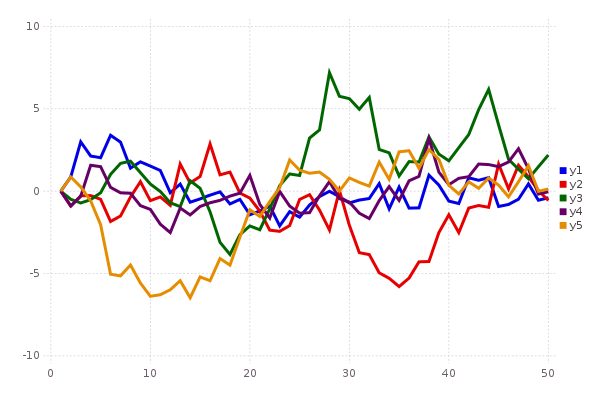

### Functions

Plot multiple functions.  You can also put the function first.

```julia
plot(0:0.01:4π,[sin,cos])
```


### 

You can also call it with plot(f, xmin, xmax).

```julia
plot([sin,cos],0,4π)
```

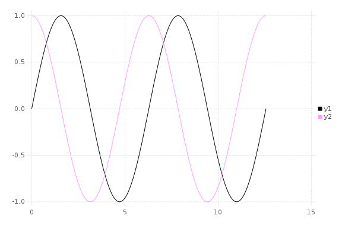

### 

Or make a parametric plot (i.e. plot: (fx(u), fy(u))) with plot(fx, fy, umin, umax).

```julia
plot(sin,(x->begin  # /home/tom/.julia/v0.4/Plots/docs/example_generation.jl, line 33:
            sin(2x)
        end),0,2π,legend=false,fillto=0)
```

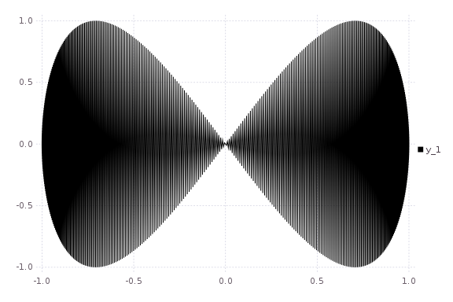

### Global

Change the guides/background without a separate call.

```julia
plot(rand(10); title="TITLE",xlabel="XLABEL",ylabel="YLABEL",background_color=RGB(0.2,0.2,0.2))
```

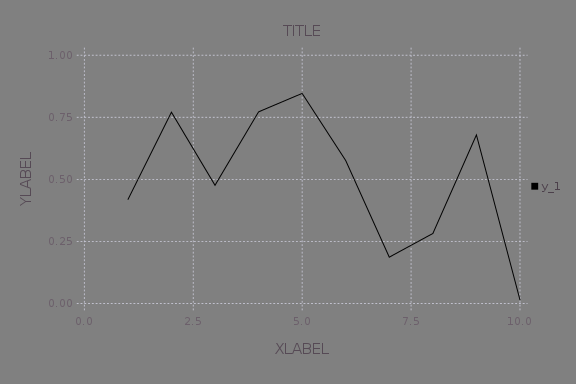

### Two-axis

Use the `axis` or `axiss` arguments.

Note: Currently only supported with Qwt and PyPlot

```julia
plot(Vector[randn(100),randn(100) * 100]; axis=[:l,:r],ylabel="LEFT",yrightlabel="RIGHT")
```

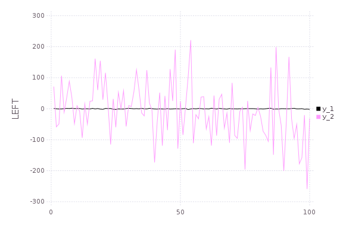

### Vectors w/ pluralized args

Plot multiple series with different numbers of points.  Mix arguments that apply to all series (singular... see `marker`) with arguments unique to each series (pluralized... see `colors`).

```julia
plot(Vector[rand(10),rand(20)]; marker=:ellipse,markersize=8,colors=[:red,:blue])
```

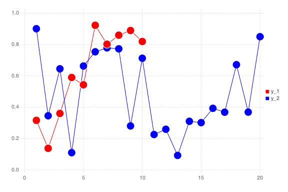

### Build plot in pieces

Start with a base plot...

```julia
plot(rand(100) / 3; reg=true,fillto=0)
```

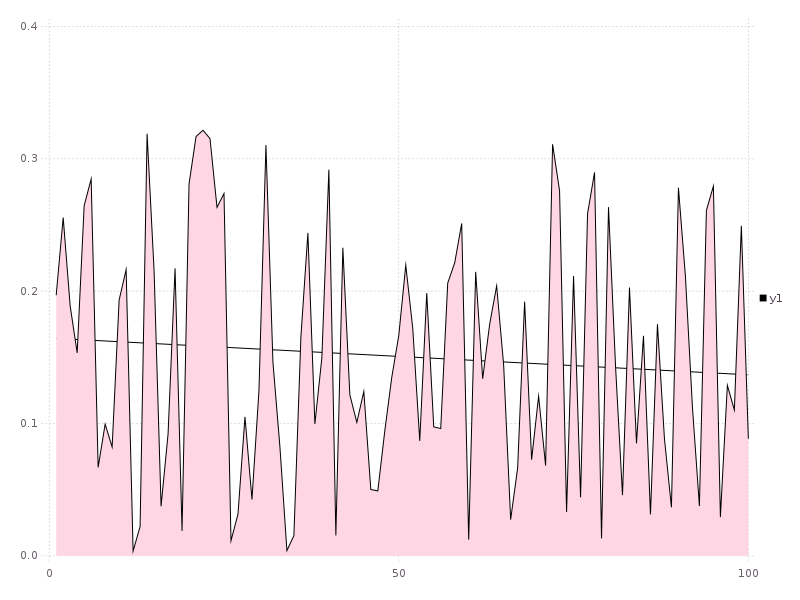

### 

and add to it later.

```julia
scatter!(rand(100); markersize=6,c=:blue)
```

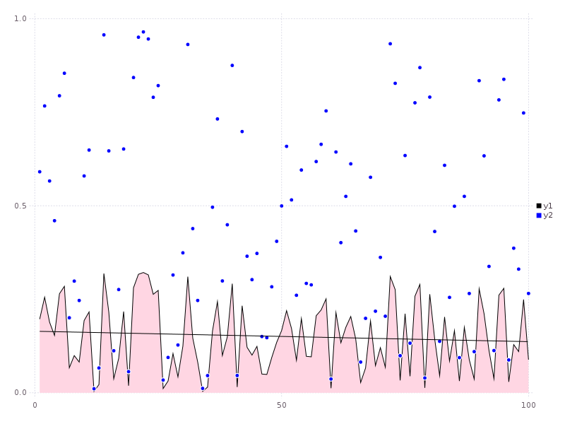

### Heatmaps


```julia
heatmap(randn(10000),randn(10000); nbins=100)
```

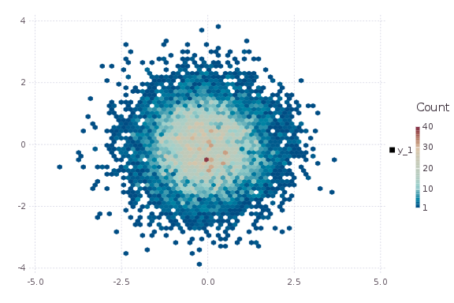

### Line types


```julia
types = intersect(supportedTypes(),[:line,:path,:steppre,:steppost,:sticks,:scatter])
n = length(types)
x = Vector[sort(rand(20)) for i = 1:n]
y = rand(20,n)
plot(x,y; t=types,lab=map(string,types))
```

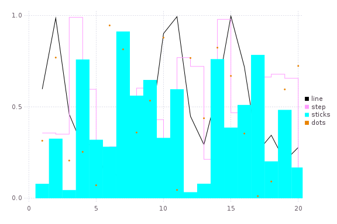

### Line styles


```julia
styles = setdiff(supportedStyles(),[:auto])
plot(cumsum(randn(20,length(styles)),1); style=:auto,label=map(string,styles),w=5)
```

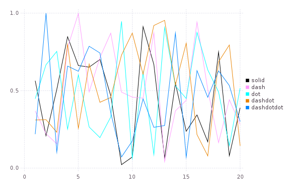

### Marker types


```julia
markers = setdiff(supportedMarkers(),[:none,:auto])
scatter(0.5:9.5,[fill(i - 0.5,10) for i = length(markers):-1:1]; marker=:auto,label=map(string,markers),markersize=10)
```

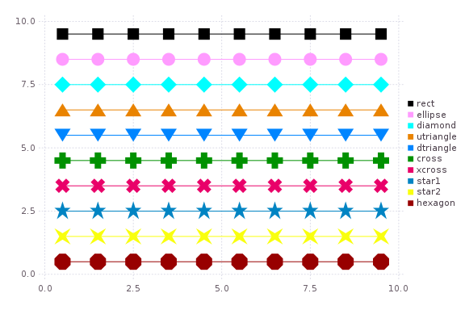

### Bar

x is the midpoint of the bar. (todo: allow passing of edges instead of midpoints)

```julia
bar(randn(1000))
```

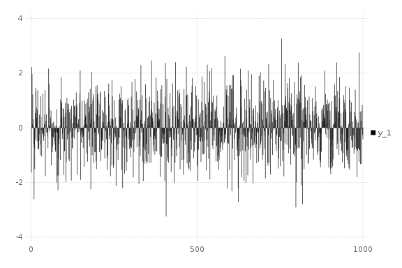

### Histogram


```julia
histogram(randn(1000); nbins=50)
```

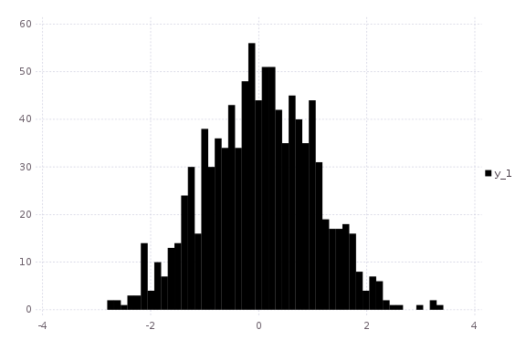

### Subplots

  subplot and subplot! are distinct commands which create many plots and add series to them in a circular fashion.
  You can define the layout with keyword params... either set the number of plots `n` (and optionally number of rows `nr` or 
  number of columns `nc`), or you can set the layout directly with `layout`.  

  Note: Gadfly is not very friendly here, and although you can create a plot and save a PNG, I haven't been able to actually display it.


```julia
subplot(randn(100,5); layout=[1,1,3],linetypes=[:line,:hist,:scatter,:step,:bar],nbins=10,legend=false)
```

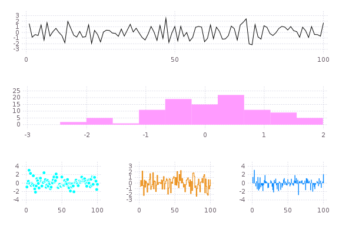

### Adding to subplots

Note here the automatic grid layout, as well as the order in which new series are added to the plots.

```julia
subplot(randn(100,5); n=4)
```

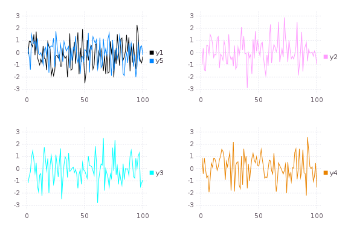

### 


```julia
subplot!(randn(100,3))
```

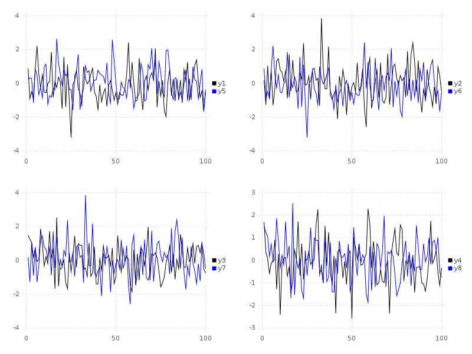

### Open/High/Low/Close

Create an OHLC chart.  Pass in a vector of 4-tuples as your `y` argument.  Adjust the tick width with arg `markersize`.

```julia
n = 20
hgt = rand(n) + 1
bot = randn(n)
openpct = rand(n)
closepct = rand(n)
y = [OHLC(openpct[i] * hgt[i] + bot[i],bot[i] + hgt[i],bot[i],closepct[i] * hgt[i] + bot[i]) for i = 1:n]
ohlc(y; markersize=8)
```

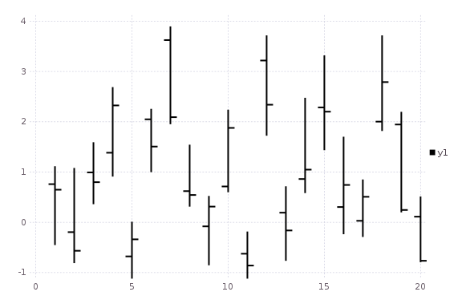

