# Examples for backend: qwt

- Supported arguments: `annotation`, `axis`, `background_color`, `color`, `color_palette`, `fillrange`, `fillcolor`, `foreground_color`, `group`, `heatmap_c`, `label`, `layout`, `legend`, `linestyle`, `linetype`, `linewidth`, `markershape`, `markercolor`, `markersize`, `n`, `nbins`, `nc`, `nr`, `pos`, `reg`, `show`, `size`, `title`, `windowtitle`, `x`, `xlabel`, `xlims`, `xticks`, `y`, `ylabel`, `ylims`, `yrightlabel`, `yticks`, `xscale`, `yscale`
- Supported values for axis: `:auto`, `:left`, `:right`
- Supported values for linetype: `:none`, `:line`, `:path`, `:steppre`, `:steppost`, `:sticks`, `:scatter`, `:heatmap`, `:hexbin`, `:hist`, `:bar`, `:hline`, `:vline`
- Supported values for linestyle: `:auto`, `:solid`, `:dash`, `:dot`, `:dashdot`, `:dashdotdot`
- Supported values for marker: `:none`, `:auto`, `:rect`, `:ellipse`, `:diamond`, `:utriangle`, `:dtriangle`, `:cross`, `:xcross`, `:star1`, `:star2`, `:hexagon`
- Is `subplot`/`subplot!` supported? Yes

### Initialize

```julia
using Plots
qwt()
```

### Lines

A simple line plot of the columns.

```julia
plot(fakedata(50,5),w=3)
```

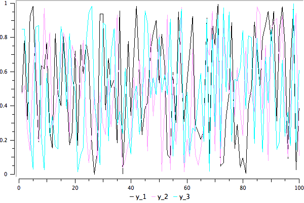

### Functions

Plot multiple functions.  You can also put the function first, or use the form `plot(f, xmin, xmax)` where f is a Function or AbstractVector{Function}.

```julia
plot(0:0.01:4π,[sin,cos])
```

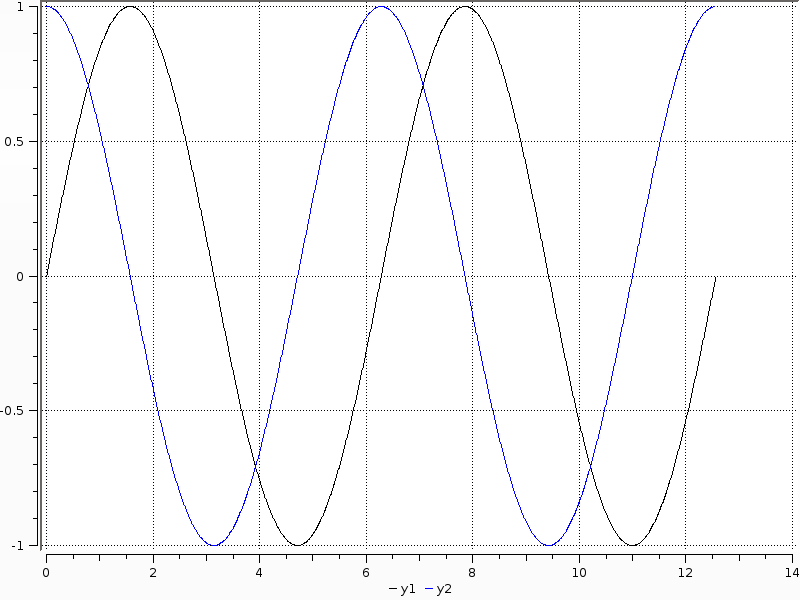

### 

Or make a parametric plot (i.e. plot: (fx(u), fy(u))) with plot(fx, fy, umin, umax).

```julia
plot(sin,(x->begin  # /home/tom/.julia/v0.4/Plots/docs/example_generation.jl, line 40:
            sin(2x)
        end),0,2π,line=4,leg=false,fill=(0,:orange))
```

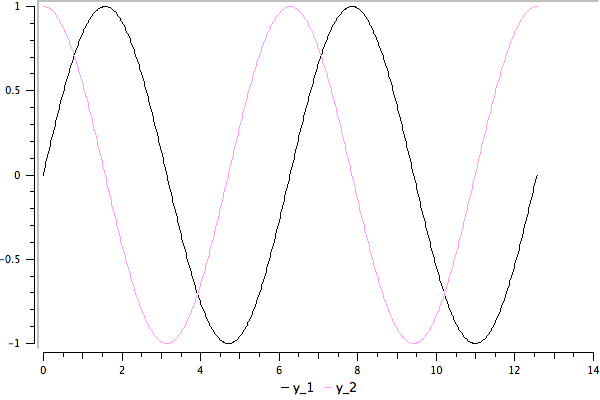

### Colors

Access predefined palettes (or build your own with the `colorscheme` method).  Line/marker colors are auto-generated from the plot's palette, unless overridden.  Set the `z` argument to turn on series gradients.

```julia
y = rand(100)
plot(0:10:100,rand(11,4),lab="lines",w=3,palette=:grays,fill=(0.5,:auto))
scatter!(y,z=abs(y - 0.5),m=(10,:heat),lab="grad")
```

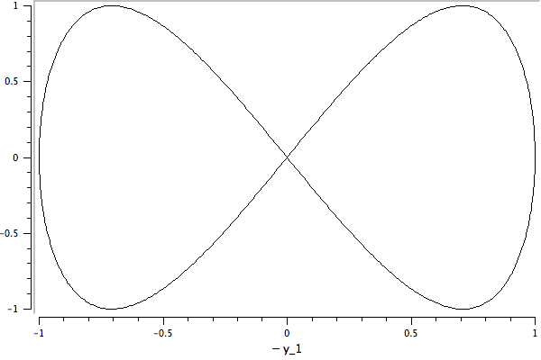

### Global

Change the guides/background/limits/ticks.  Convenience args `xaxis` and `yaxis` allow you to pass a tuple or value which will be mapped to the relevant args automatically.  The `xaxis` below will be replaced with `xlabel` and `xlims` args automatically during the preprocessing step. You can also use shorthand functions: `title!`, `xaxis!`, `yaxis!`, `xlabel!`, `ylabel!`, `xlims!`, `ylims!`, `xticks!`, `yticks!`

```julia
plot(rand(20,3),title="TITLE",xaxis=("XLABEL",(-5,30),0:2:20,:flip),yaxis=("YLABEL",:log10),background_color=RGB(0.2,0.2,0.2),leg=false)
```

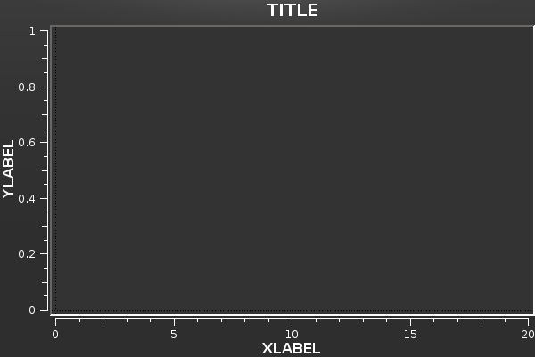

### Two-axis

Use the `axis` arguments.

Note: Currently only supported with Qwt and PyPlot

```julia
plot(Vector[randn(100),randn(100) * 100]; axis=[:l :r],ylabel="LEFT",yrightlabel="RIGHT")
```

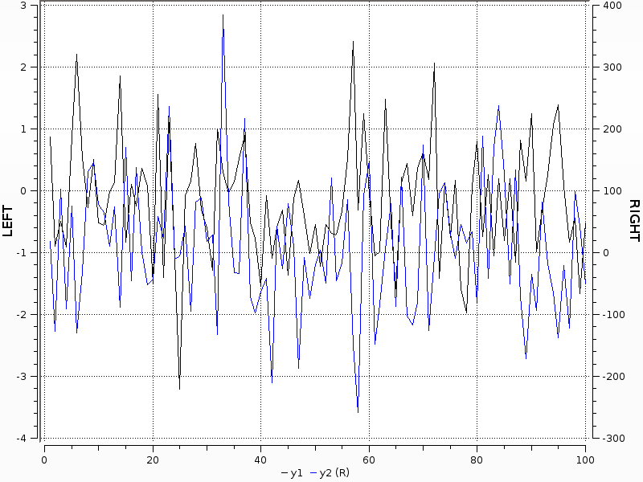

### Arguments

Plot multiple series with different numbers of points.  Mix arguments that apply to all series (marker/markersize) with arguments unique to each series (colors).  Special arguments `line`, `marker`, and `fill` will automatically figure out what arguments to set (for example, we are setting the `linestyle`, `linewidth`, and `color` arguments with `line`.)  Note that we pass a matrix of colors, and this applies the colors to each series.

```julia
plot(Vector[rand(10),rand(20)]; marker=(:ellipse,8),line=(:dot,3,[:black :orange]))
```


### Build plot in pieces

Start with a base plot...

```julia
plot(rand(100) / 3,reg=true,fill=(0,:green))
```

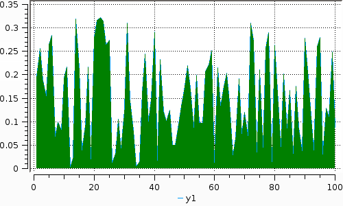

### 

and add to it later.

```julia
scatter!(rand(100),markersize=6,c=:orange)
```

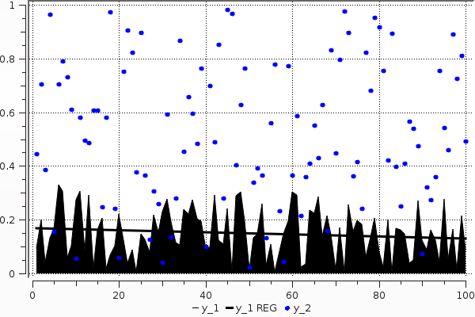

### Heatmaps


```julia
heatmap(randn(10000),randn(10000),nbins=100)
```

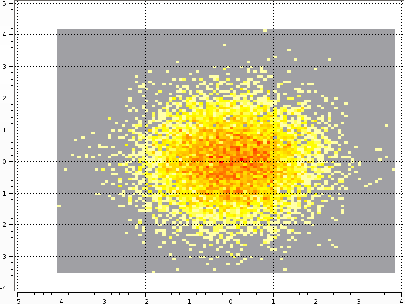

### Line types


```julia
types = intersect(supportedTypes(),[:line,:path,:steppre,:steppost,:sticks,:scatter])'
n = length(types)
x = Vector[sort(rand(20)) for i = 1:n]
y = rand(20,n)
plot(x,y,line=(types,3),lab=map(string,types),ms=15)
```

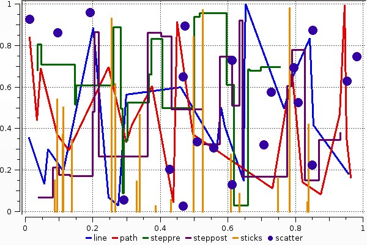

### Line styles


```julia
styles = setdiff(supportedStyles(),[:auto])'
plot(cumsum(randn(20,length(styles)),1); style=:auto,label=map(string,styles),w=5)
```

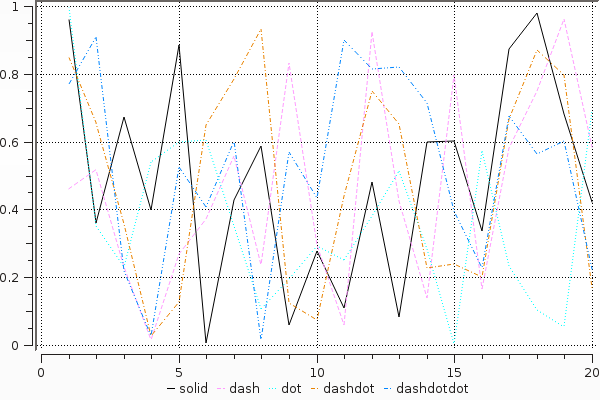

### Marker types


```julia
markers = setdiff(supportedMarkers(),[:none,:auto])'
scatter(0.5:9.5,[fill(i - 0.5,10) for i = length(markers):-1:1]; marker=:auto,label=map(string,markers),ms=12)
```

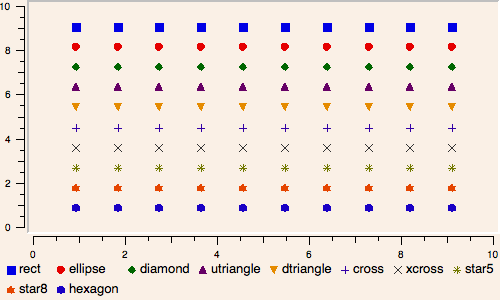

### Bar

x is the midpoint of the bar. (todo: allow passing of edges instead of midpoints)

```julia
bar(randn(999))
```

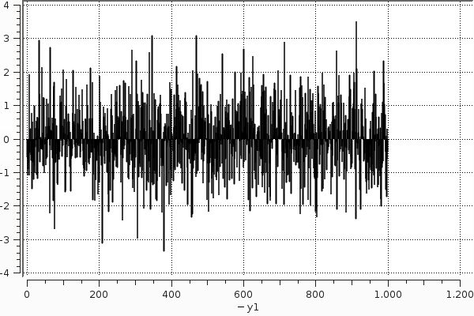

### Histogram


```julia
histogram(randn(1000),nbins=50)
```

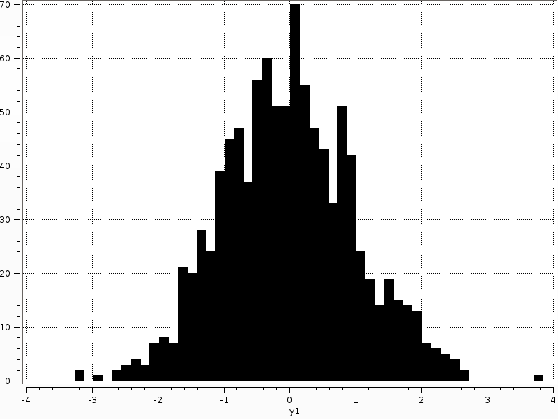

### Subplots

  subplot and subplot! are distinct commands which create many plots and add series to them in a circular fashion.
  You can define the layout with keyword params... either set the number of plots `n` (and optionally number of rows `nr` or 
  number of columns `nc`), or you can set the layout directly with `layout`.


```julia
subplot(randn(100,5),layout=[1,1,3],t=[:line :hist :scatter :step :bar],nbins=10,leg=false)
```

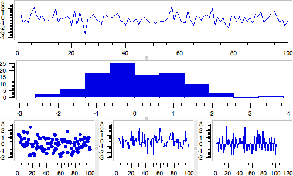

### Adding to subplots

Note here the automatic grid layout, as well as the order in which new series are added to the plots.

```julia
subplot(fakedata(100,10),n=4,palette=[:grays :blues :heat :lightrainbow],bg=[:orange :pink :darkblue :black])
```

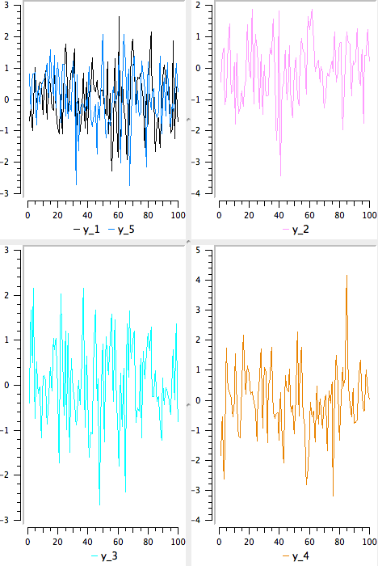

### 


```julia
subplot!(fakedata(100,10))
```

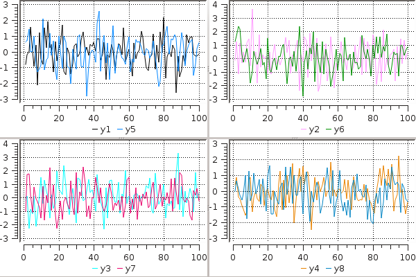

### Annotations

Currently only text annotations are supported.  Pass in a tuple or vector-of-tuples: (x,y,text).  `annotate!(ann)` is shorthand for `plot!(; annotation=ann)`

```julia
y = rand(10)
plot(y,ann=(3,y[3],"this is #3"))
annotate!([(5,y[5],"this is #5"),(9,y[10],"this is #10")])
```

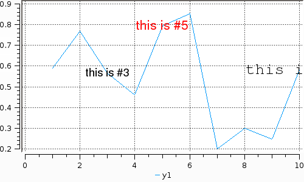

