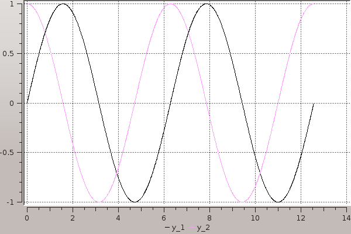
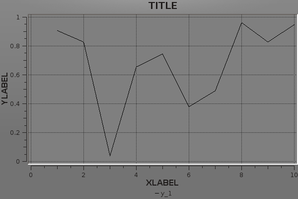
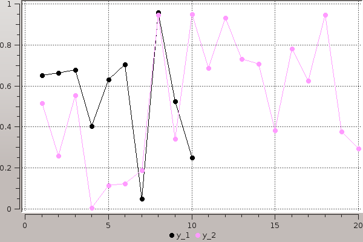
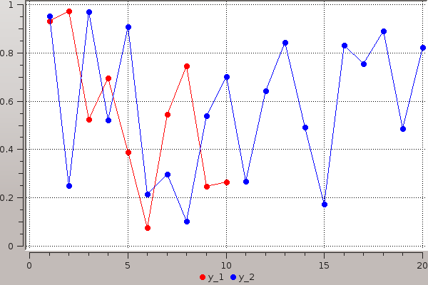
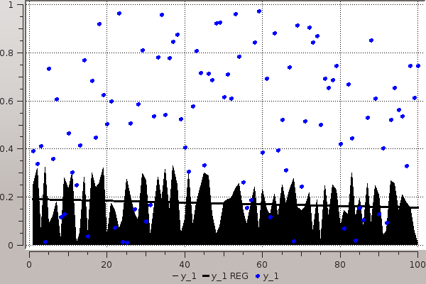
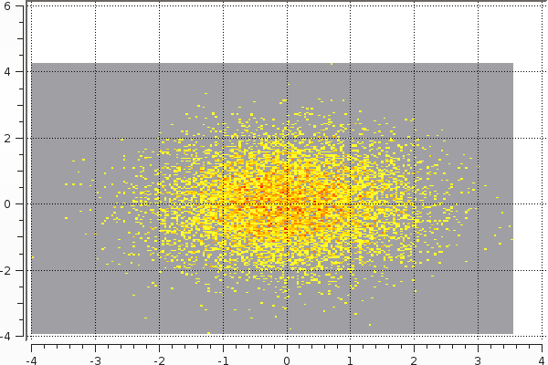
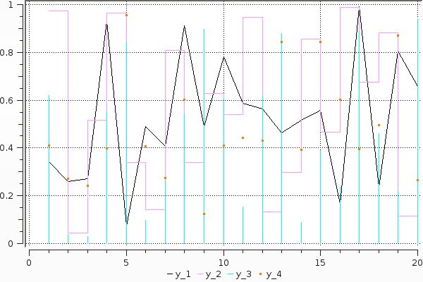
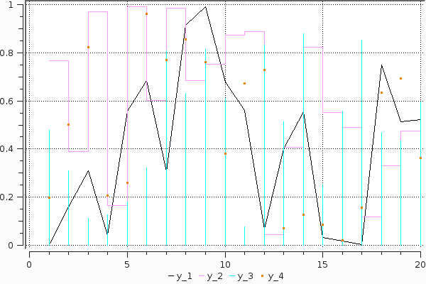
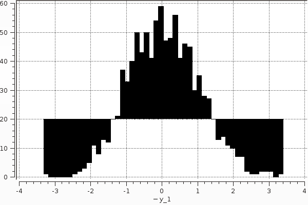

### Lines

A simple line plot of the 3 columns.

```julia
plot(rand(100,3))
```


### Functions

Plot multiple functions

```julia
plot(0:0.01:4π,[sin,cos])
```



### Global

Change the guides/background without a separate call.

```julia
plot(rand(10); title="TITLE",xlabel="XLABEL",ylabel="YLABEL",background_color=RGB(0.5,0.5,0.5))
```



### Vectors

Plot multiple series with different numbers of points.

```julia
plot(Vector[rand(10),rand(20)]; marker=:ellipse,markersize=8)
```



### Vectors w/ pluralized args

Mix arguments that apply to all series with arguments unique to each series.

```julia
plot(Vector[rand(10),rand(20)]; marker=:ellipse,markersize=8,colors=[:red,:blue])
```



### Build plot in pieces

You can add to a plot at any time.

```julia
plot(rand(100) / 3; reg=true,fillto=0)
scatter!(rand(100); markersize=6,color=:blue)
```



### Heatmaps


```julia
heatmap(randn(10000),randn(10000); nbins=200)
```



### Lots of line types

Options: (:line, :step, :stepinverted, :sticks, :dots, :none, :heatmap, :hexbin, :hist, :bar)  
Note: some may not work with all backends

```julia
plot(rand(20,4); linetypes=[:line,:step,:sticks,:dots])
```



### Bar

x is the midpoint of the bar. (todo: allow passing of edges instead of midpoints)

```julia
bar(randn(1000))
```



### Histogram

note: fillto isn't supported on all backends

```julia
histogram(randn(1000); nbins=50,fillto=20)
```



