# Examples for backend: unicodeplots

- Supported arguments: `args`, `axis`, `color`, `kwargs`, `label`, `legend`, `linestyle`, `linetype`, `marker`, `markercolor`, `markersize`, `nbins`, `size`, `title`, `width`, `windowtitle`, `xlabel`, `ylabel`, `yrightlabel`
- Supported values for axis: `:auto`, `:left`
- Supported values for linetype: `:none`, `:line`, `:step`, `:sticks`, `:scatter`, `:heatmap`, `:hexbin`, `:hist`, `:bar`
- Supported values for linestyle: `:auto`, `:solid`
- Supported values for marker: `:none`, `:auto`, `:ellipse`
- Is `subplot`/`subplot!` supported? Yes

### Initialize

```julia
using Plots
unicodeplots!()
```

### Lines

A simple line plot of the 3 columns.

```julia
plot(rand(100,3))
```

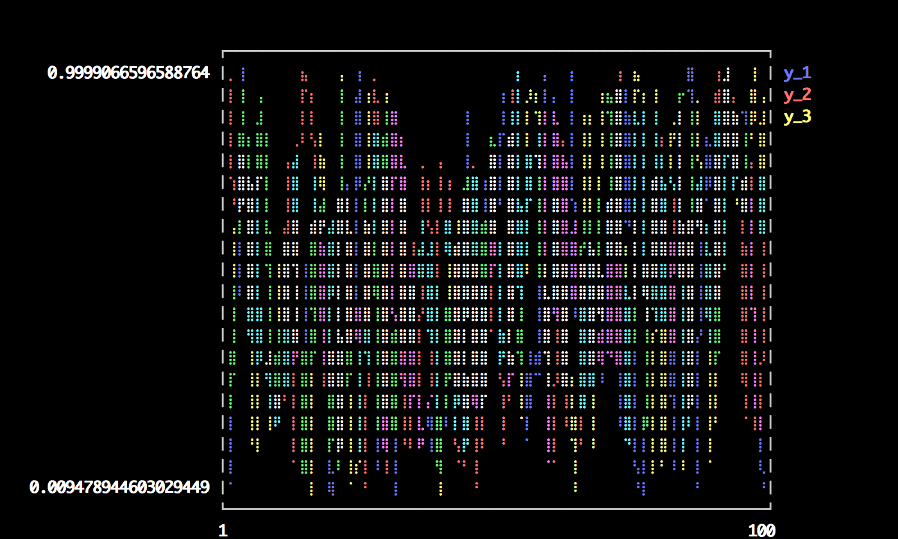

### Functions

Plot multiple functions.  You can also put the function first.

```julia
plot(0:0.01:4π,[sin,cos])
```

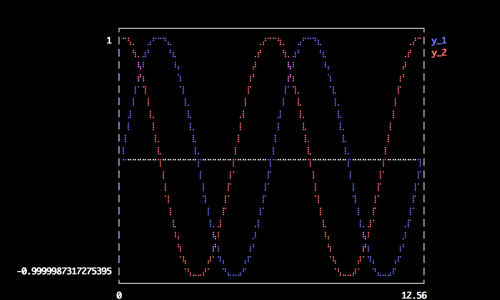

### 

You can also call it with plot(f, xmin, xmax).

```julia
plot([sin,cos],0,4π)
```

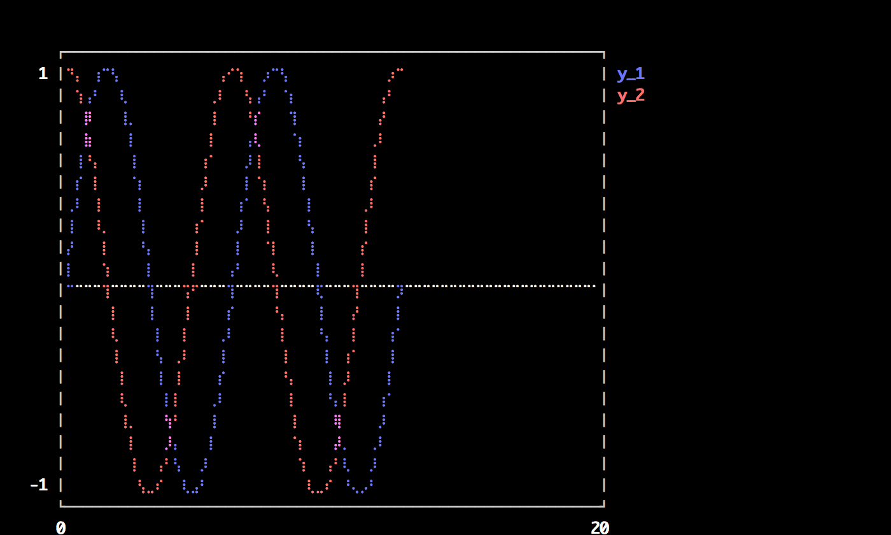

### 

Or make a parametric plot (i.e. plot: (fx(u), fy(u))) with plot(fx, fy, umin, umax).

```julia
plot(sin,(x->begin  # /home/tom/.julia/v0.4/Plots/docs/example_generation.jl, line 33:
            sin(2x)
        end),0,2π)
```

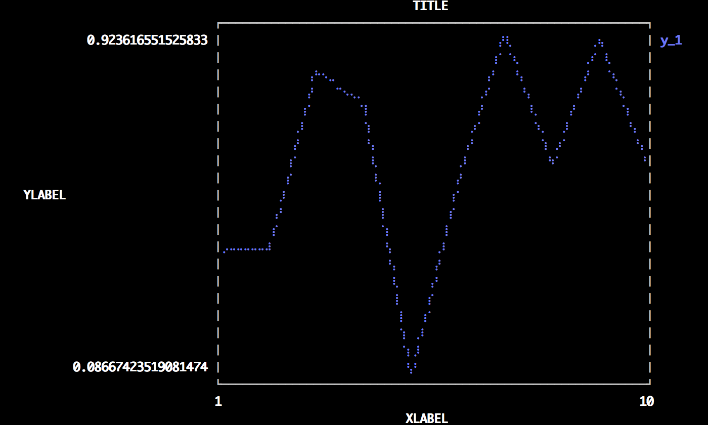

### Global

Change the guides/background without a separate call.

```julia
plot(rand(10); title="TITLE",xlabel="XLABEL",ylabel="YLABEL",background_color=RGB(0.5,0.5,0.5))
```

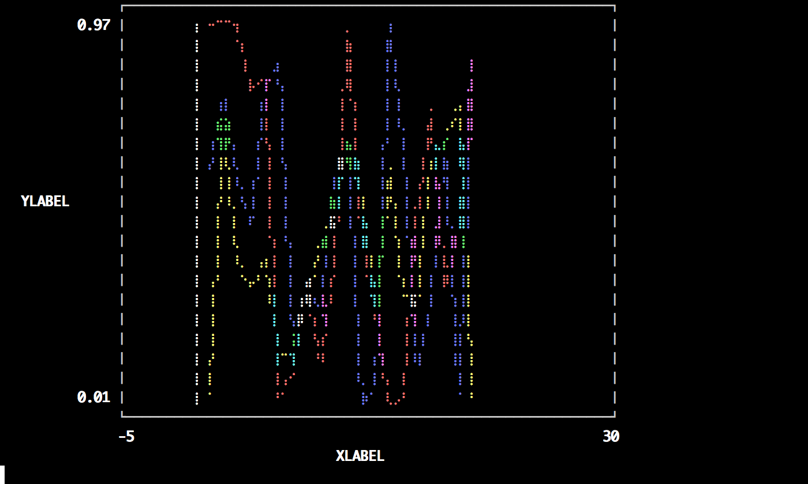

### Two-axis

Use the `axis` or `axiss` arguments.

Note: Currently only supported with Qwt and PyPlot

```julia
plot(Vector[randn(100),randn(100) * 100]; axiss=[:left,:right],ylabel="LEFT",yrightlabel="RIGHT")
```

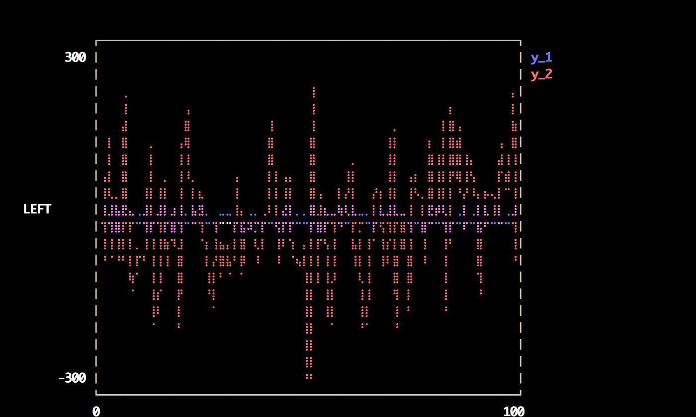

### Vectors w/ pluralized args

Plot multiple series with different numbers of points.  Mix arguments that apply to all series (singular... see `marker`) with arguments unique to each series (pluralized... see `colors`).

```julia
plot(Vector[rand(10),rand(20)]; marker=:ellipse,markersize=8,colors=[:red,:blue])
```

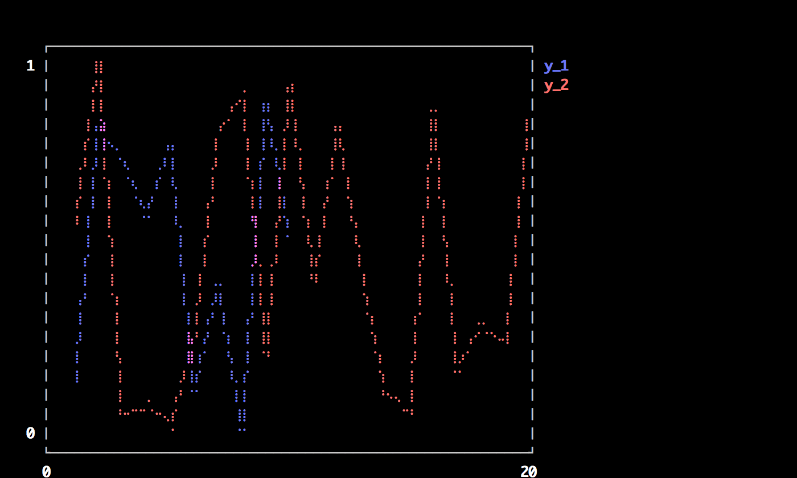

### Build plot in pieces

Start with a base plot...

```julia
plot(rand(100) / 3; reg=true,fillto=0)
```

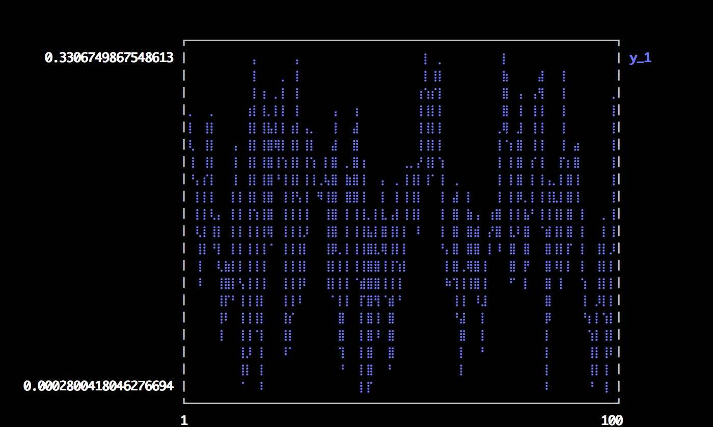

### 

and add to it later.

```julia
scatter!(rand(100); markersize=6,color=:blue)
```

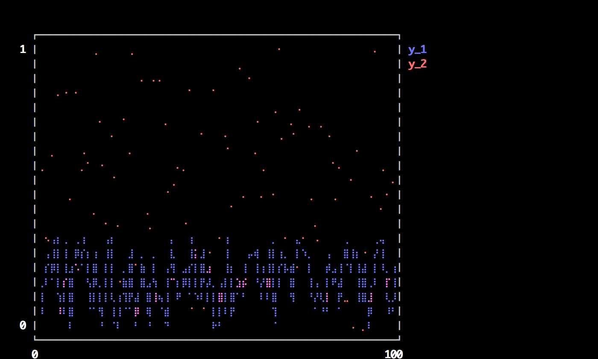

### Heatmaps


```julia
heatmap(randn(10000),randn(10000); nbins=100)
```

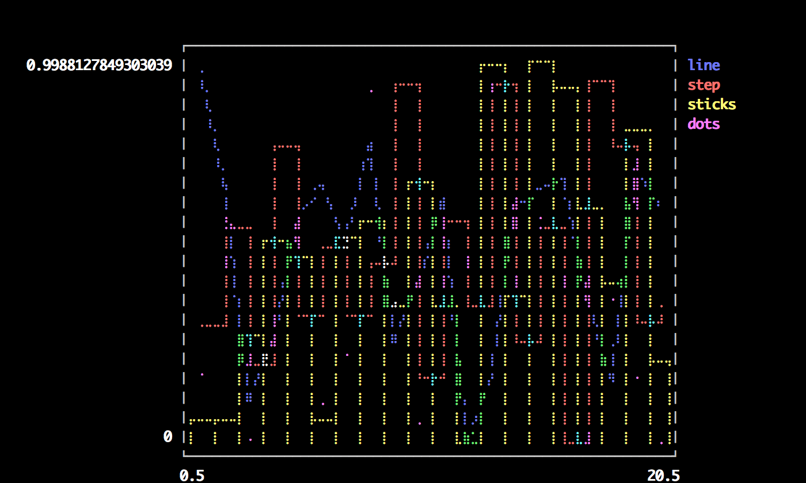

### Suported line types

All options: (:line, :orderedline, :step, :stepinverted, :sticks, :scatter, :none, :heatmap, :hexbin, :hist, :bar)

```julia
types = intersect(supportedTypes(),[:line,:step,:stepinverted,:sticks,:scatter])
n = length(types)
x = Vector[sort(rand(20)) for i = 1:n]
y = rand(20,n)
plot(x,y; linetypes=types,labels=map(string,types))
```

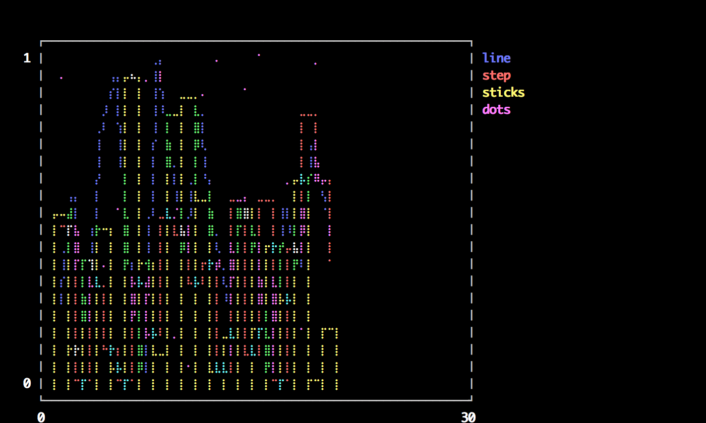

### Supported line styles

All options: (:solid, :dash, :dot, :dashdot, :dashdotdot)

```julia
styles = setdiff(supportedStyles(),[:auto])
plot(rand(20,length(styles)); linestyle=:auto,labels=map(string,styles))
```


### Supported marker types

All options: (:none, :auto, :ellipse, :rect, :diamond, :utriangle, :dtriangle, :cross, :xcross, :star1, :star2, :hexagon)

```julia
markers = setdiff(supportedMarkers(),[:none,:auto])
plot([fill(i,10) for i = 1:length(markers)]; marker=:auto,labels=map(string,markers),markersize=10)
```

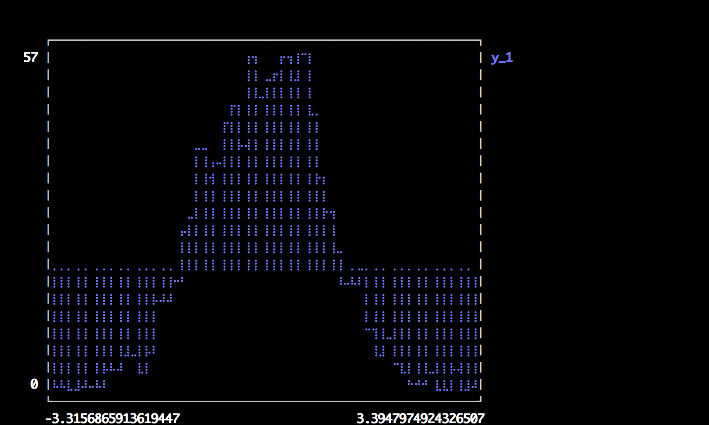

### Bar

x is the midpoint of the bar. (todo: allow passing of edges instead of midpoints)

```julia
bar(randn(1000))
```

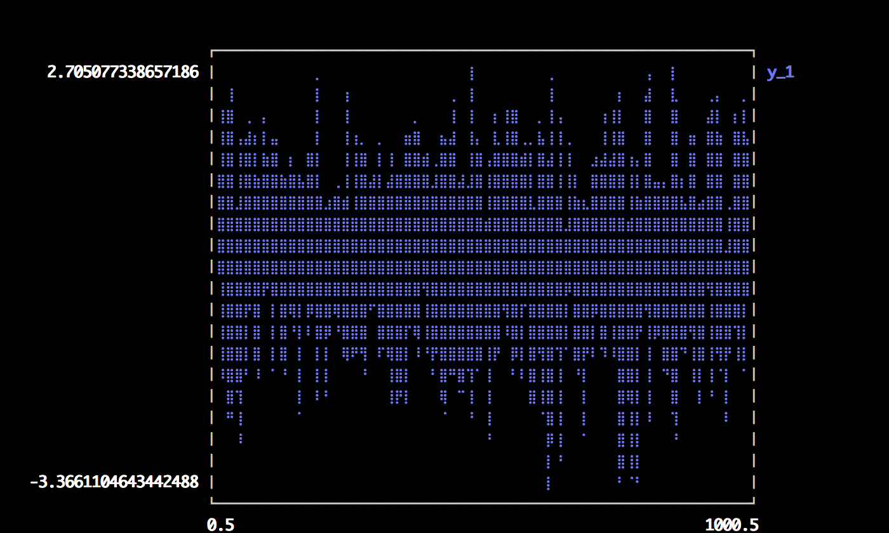

### Histogram

note: fillto isn't supported on all backends

```julia
histogram(randn(1000); nbins=50,fillto=20)
```

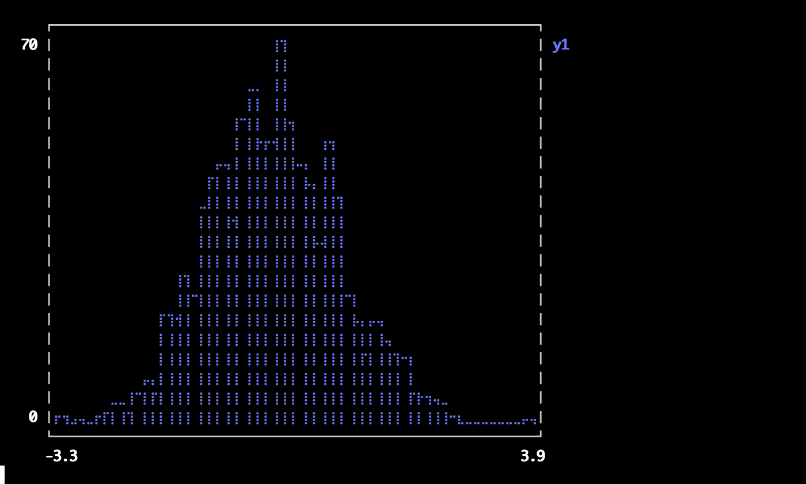

### Subplots

  subplot and subplot! are distinct commands which create many plots and add series to them in a circular fashion.
  You can define the layout with keyword params... either set the number of plots `n` (and optionally number of rows `nr` or 
  number of columns `nc`), or you can set the layout directly with `layout`.  

  Note: Gadfly is not very friendly here, and although you can create a plot and save a PNG, I haven't been able to actually display it.


```julia
subplot(randn(100,5); layout=[1,1,3],linetypes=[:line,:hist,:scatter,:step,:bar],nbins=10,legend=false)
```

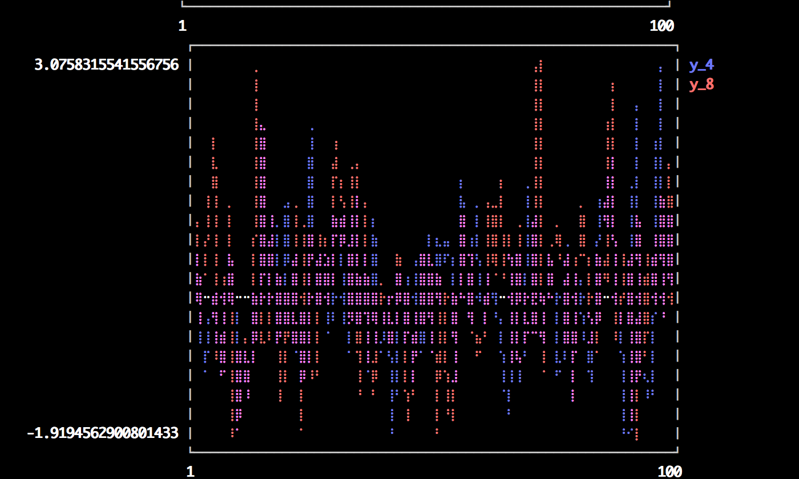

### Adding to subplots

Note here the automatic grid layout, as well as the order in which new series are added to the plots.

```julia
subplot(randn(100,5); n=4)
```

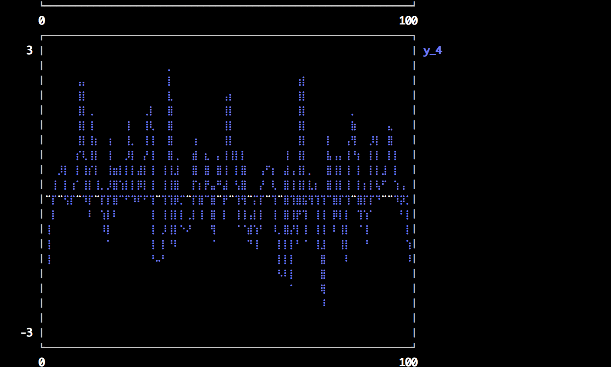

### 


```julia
subplot!(randn(100,3))
```

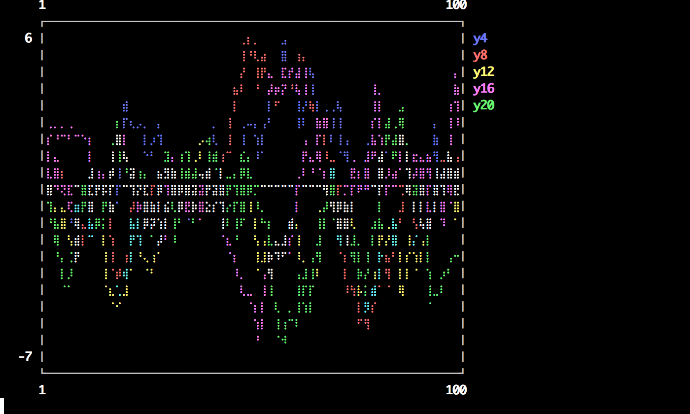

