### Lines

A simple line plot of the 3 columns.

```julia
plot(rand(100,3))
```

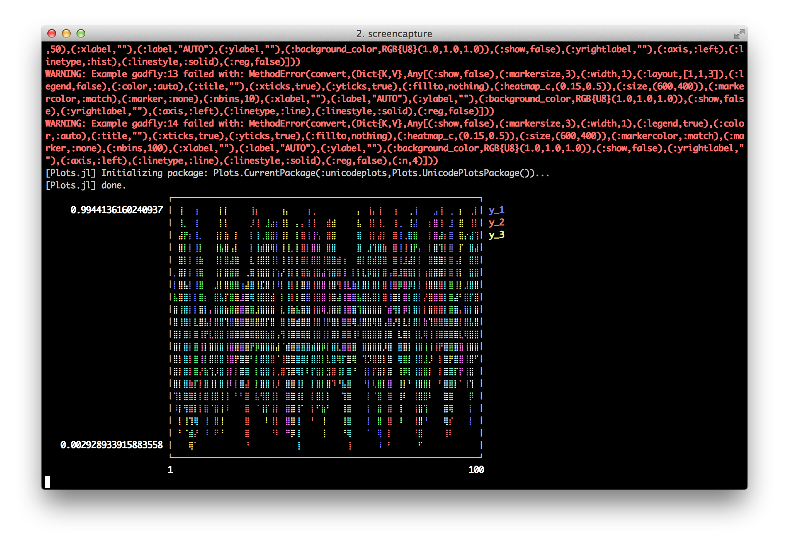

### Functions

Plot multiple functions.

```julia
plot(0:0.01:4π,[sin,cos])
```

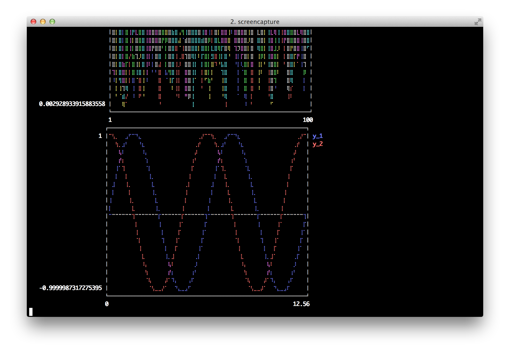

### 

You can also call it with (xmin, xmax).

```julia
plot([sin,cos],0,4π)
```

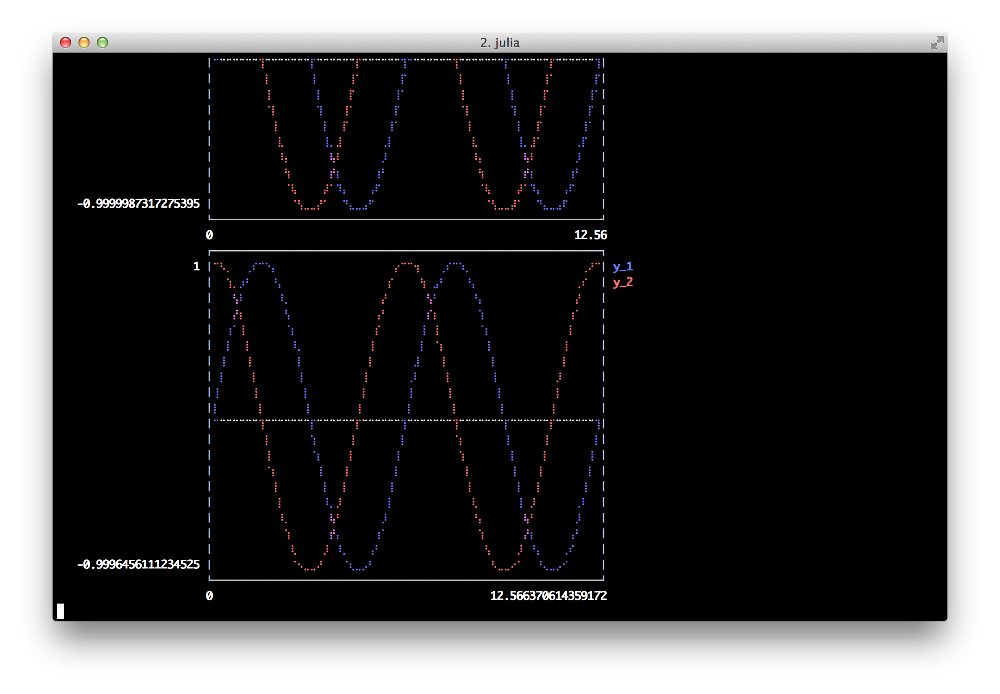

### Global

Change the guides/background without a separate call.

```julia
plot(rand(10); title="TITLE",xlabel="XLABEL",ylabel="YLABEL",background_color=RGB(0.5,0.5,0.5))
```

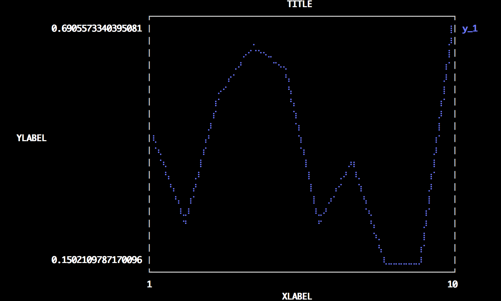

### Two-axis

Use the `axis` or `axiss` arguments.

Note: This is only supported with Qwt right now

```julia
plot(Vector[randn(100),randn(100) * 100]; axiss=[:left,:right])
```

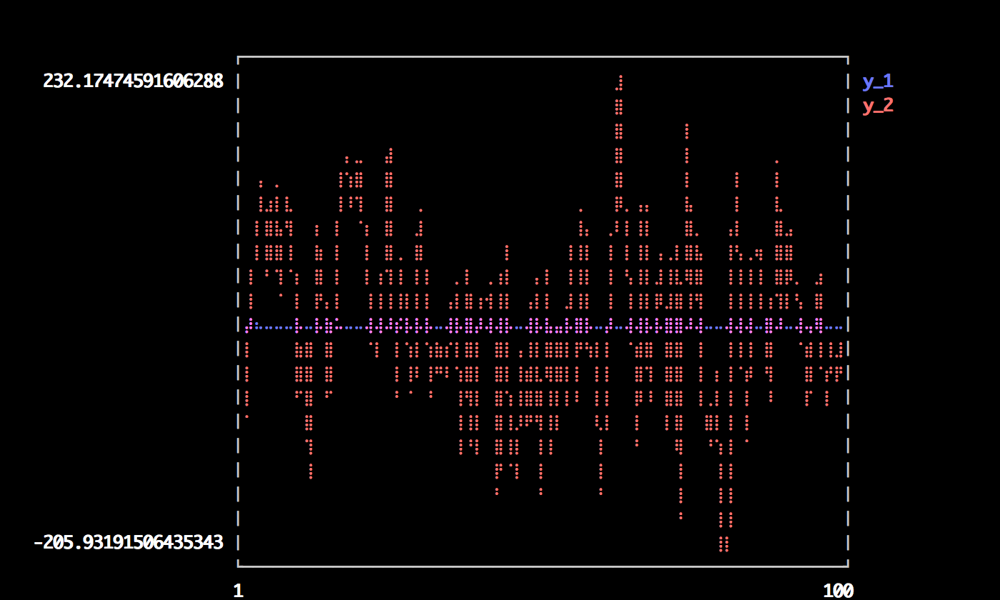

### Vectors w/ pluralized args

Plot multiple series with different numbers of points.  Mix arguments that apply to all series (singular... see `marker`) with arguments unique to each series (pluralized... see `colors`).

```julia
plot(Vector[rand(10),rand(20)]; marker=:ellipse,markersize=8,colors=[:red,:blue])
```

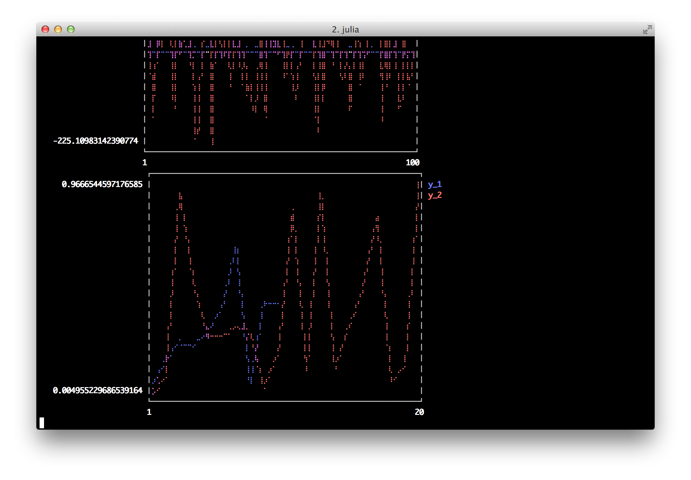

### Build plot in pieces

Start with a base plot...

```julia
plot(rand(100) / 3; reg=true,fillto=0)
```

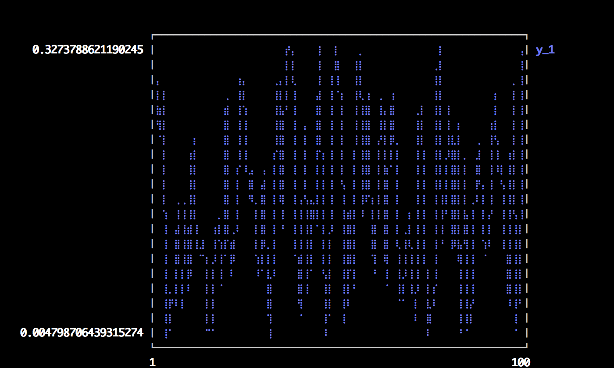

### 

and add to it later.

```julia
scatter!(rand(100); markersize=6,color=:blue)
```

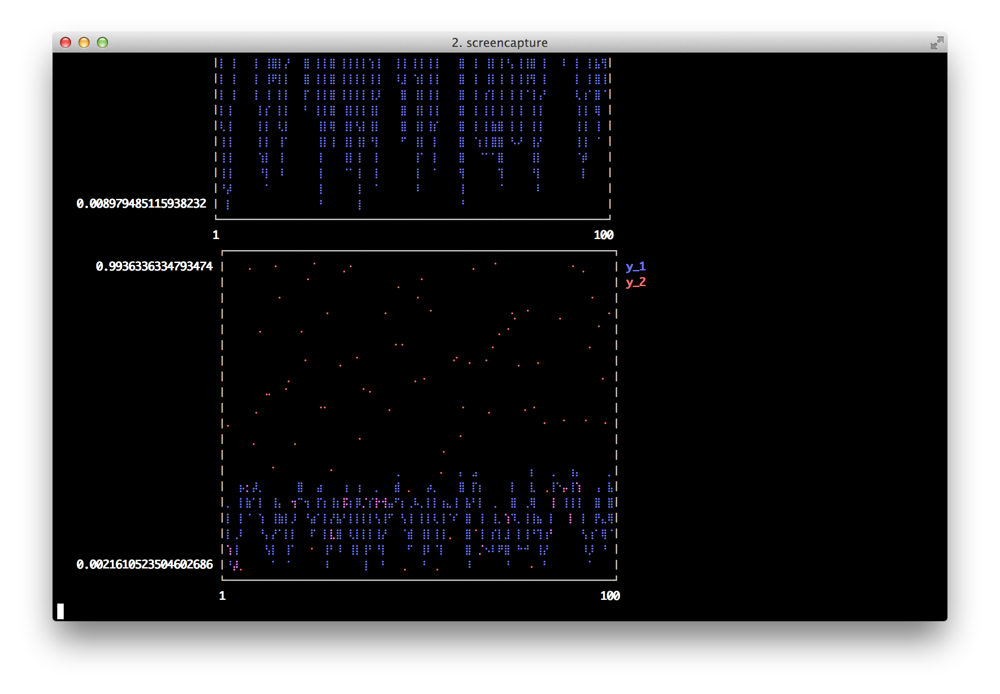

### Lots of line types

Options: (:line, :step, :stepinverted, :sticks, :dots, :none, :heatmap, :hexbin, :hist, :bar)  
Note: some may not work with all backends

```julia
plot(rand(20,4); linetypes=[:line,:step,:sticks,:dots],labels=["line","step","sticks","dots"])
```

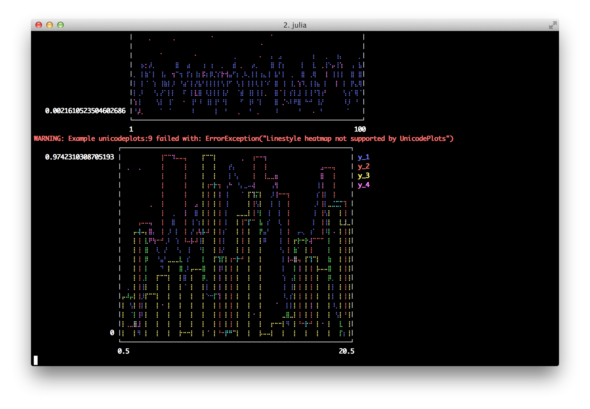

### Bar

x is the midpoint of the bar. (todo: allow passing of edges instead of midpoints)

```julia
bar(randn(1000))
```

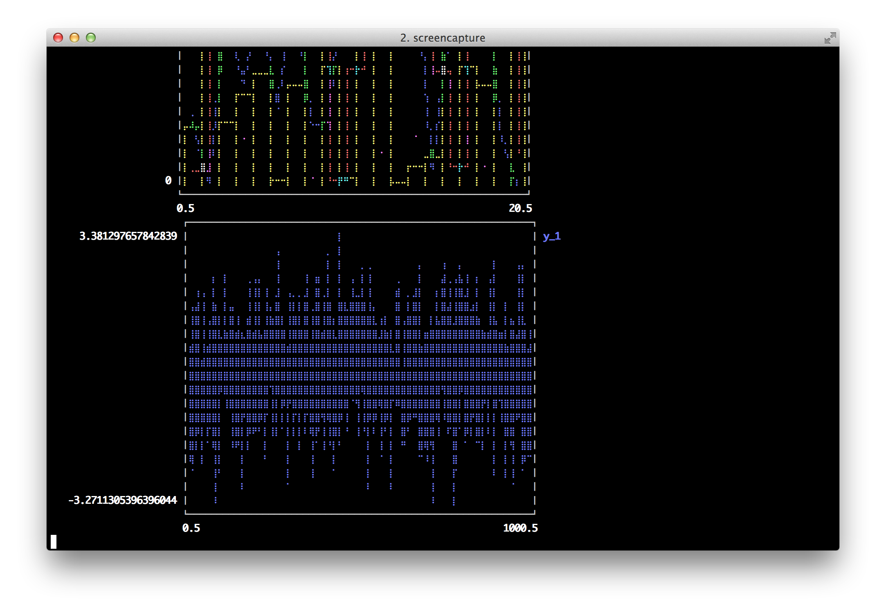

### Histogram

note: fillto isn't supported on all backends

```julia
histogram(randn(1000); nbins=50,fillto=20)
```

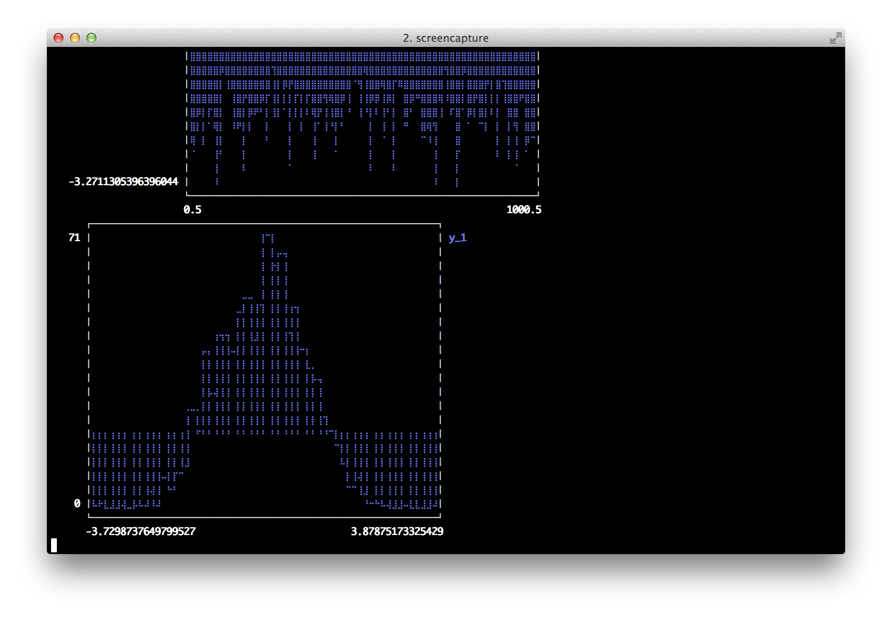

### Subplots

  subplot and subplot! are distinct commands which create many plots and add series to them in a circular fashion.
  You can define the layout with keyword params... either set the number of plots `n` (and optionally number of rows `nr` or 
  number of columns `nc`), or you can set the layout directly with `layout`.  

  Note: Gadfly is not very friendly here, and although you can create a plot and save a PNG, I haven't been able to actually display it.


```julia
subplot(randn(100,5); layout=[1,1,3],linetypes=[:line,:hist,:dots,:step,:bar],nbins=10,legend=false)
```

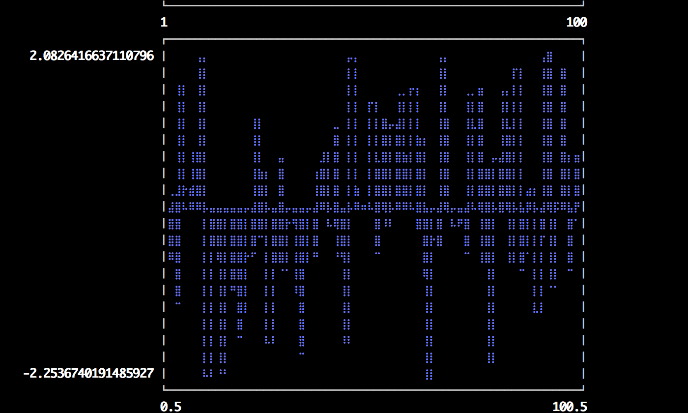

### Adding to subplots

Note here the automatic grid layout, as well as the order in which new series are added to the plots.

```julia
subplot(randn(100,5); n=4)
```


### 


```julia
subplot!(randn(100,3))
```

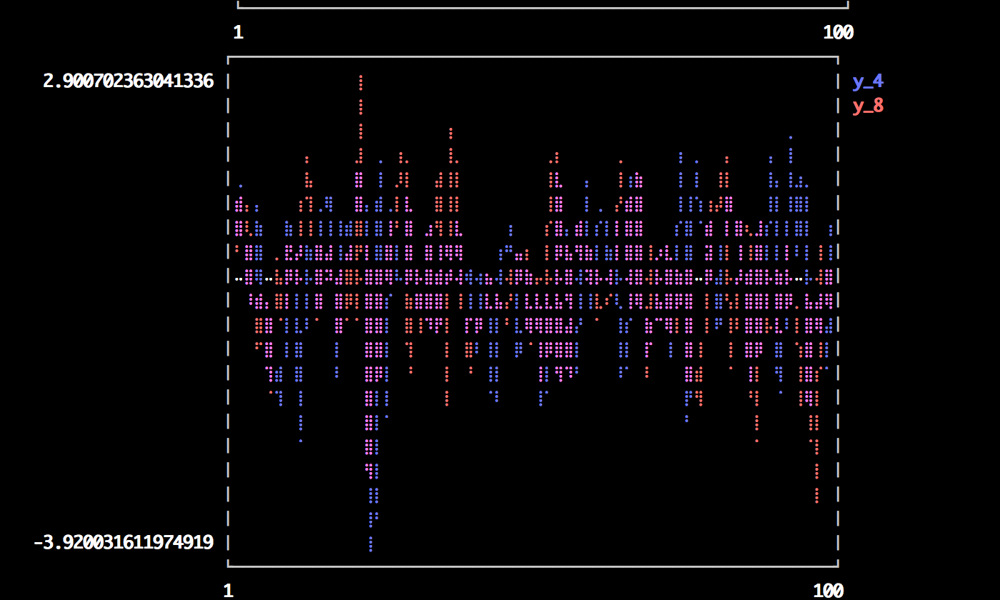

